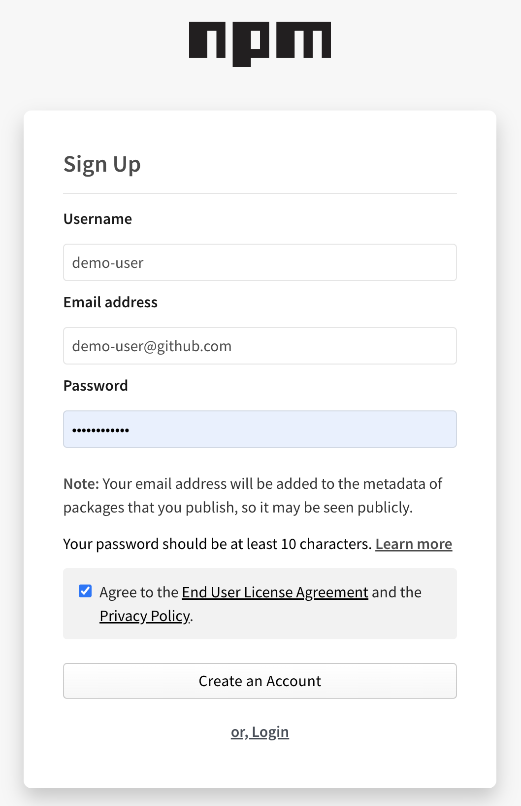
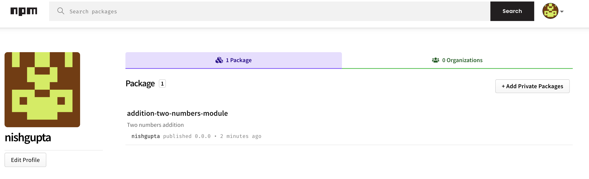

<h1 align="center">Sample repo to demonstrate npm package publish</h1>

<p align="center">
  <a href="#mega-prerequisites">Prerequisites</a> •  
  <a href="#books-resources">Resources</a>
</p>

This repository can be used as a reference guide/sample to enable publishing your first package via npm registry.

## :mega: Prerequisites

- A [npmjs account](https://docs.npmjs.com/creating-a-new-npm-user-account) with a verified e-mail address
- Basic understanding of software package registries (e.g. GitHub Packages, npm)

## Steps for Getting started
### 1. Setup a Project: Setting up a project is required before doing anything.

* Install Node.js
```
1. Go to the Node.js Downloads page https://nodejs.org/en/download
2. Download Node.js for macOS by clicking the "Macintosh Installer" option
3. Run the downloaded Node.js .pkg Installer
4. Run the installer, including accepting the license, selecting the destination, and authenticating for the install.
5. You're finished! To ensure Node.js has been installed, run node -v in your terminal - you should get something like v6.9.4
```

* Create an npm account.
```
https://www.npmjs.com/signup
```

<p align="center">
  
</p>

* Logging in to the npm account using `npm login`

```
➜  packages-npm git:(main) ✗ npm login
npm notice Log in on https://registry.npmjs.org/
Username: nishgupta
Password:
Email: (this IS public) nishantgupta.cs@gmail.com
npm notice Please use the one-time password (OTP) from your authenticator application
Enter one-time password: 465775
Logged in as nishgupta on https://registry.npmjs.org/.
```

### 2. Initializing a package is required before publishing using `npm init`

```
➜  packages-npm git:(main) ✗ npm init
This utility will walk you through creating a package.json file.
It only covers the most common items, and tries to guess sensible defaults.

See `npm help init` for definitive documentation on these fields
and exactly what they do.

Use `npm install <pkg>` afterwards to install a package and
save it as a dependency in the package.json file.

Press ^C at any time to quit.
package name: (addition-two-numbers-module) addition-two-numbers-module
version: (1.0.0) 0.0.0
description: sample package to demonstrate npm publish
entry point: (index.js)
test command:
git repository: (https://github.com/nishantms/packages-npm)
keywords: publish
author: nishant gupta
license: (ISC)
About to write to /Users/nishantms/packages-npm/package.json:

{
  "name": "addition-two-numbers-module",
  "version": "0.0.0",
  "description": "sample package to demonstrate npm publish",
  "main": "index.js",
  "scripts": {
    "test": "echo \"Error: no test specified\" && exit 1"
  },
  "repository": {
    "type": "git",
    "url": "git+https://github.com/nishantms/packages-npm.git"
  },
  "keywords": [
    "publish"
  ],
  "author": "nishant gupta",
  "license": "ISC",
  "bugs": {
    "url": "https://github.com/nishantms/packages-npm/issues"
  },
  "homepage": "https://github.com/nishantms/packages-npm#readme"
}


Is this OK? (yes) yes
```

### 3.  Building a package is required before publishing

Lets first implement a simple function that add two numbers in the npm module. This function looks like below:

File Name: index.js

```
const addFns = {
  add : function addTwoNums( num1, num2 ) {
    return (num1 + num2) ;
  }
}
  
module.exports = addFns
```

### 4. Publishing a package is required before publishing using `npm publish`

To check if your package name is usable or not, go to the command-line and type `npm search addition-two-numbers-module`

```
➜  packages-npm git:(main) ✗ npm search addition-two-numbers-module
No matches found for "addition-two-numbers-module"
```

Now after checking the name availability, go to command-line/terminal and type `npm publish`

```
➜  packages-npm git:(main) ✗ npm publish
npm notice
npm notice 📦  addition-two-numbers-module@0.0.0
npm notice === Tarball Contents ===
npm notice 5.2kB   README.md
npm notice 167.9kB images/signup.png
npm notice 132B    index.js
npm notice 559B    package.json
npm notice === Tarball Details ===
npm notice name:          addition-two-numbers-module
npm notice version:       0.0.0
npm notice filename:      addition-two-numbers-module-0.0.0.tgz
npm notice package size:  116.0 kB
npm notice unpacked size: 173.8 kB
npm notice shasum:        1693e63ebe56134a4f1d573ab73c85b98068db3b
npm notice integrity:     sha512-tZt6YI40SrGmQ[...]IBAhlFfCfKghg==
npm notice total files:   4
npm notice
npm notice Publishing to https://registry.npmjs.org/
npm notice Open https://www.npmjs.com/login/31f38b3a-5971-4302-a08f-23ef6da27597 to use your security key for authentication or enter OTP from your authenticator app
This operation requires a one-time password.
Enter OTP: 2626771879882118
+ addition-two-numbers-module@0.0.0
```

The published package is available at the following URL: `https://www.npmjs.com/package/addition-two-numbers-module`

<p align="center">
  
</p>


### 5. Use this package

* Make a fresh project directory.

```
➜  packages-npm git:(main) ✗ mkdir use-package
➜  packages-npm git:(main) ✗ cd use-package
```

* In the terminal, type `npm init` to initialize the Node project.

```
This utility will walk you through creating a package.json file.
It only covers the most common items, and tries to guess sensible defaults.

See `npm help init` for definitive documentation on these fields
and exactly what they do.

Use `npm install <pkg>` afterwards to install a package and
save it as a dependency in the package.json file.

Press ^C at any time to quit.
package name: (use-package)
version: (1.0.0)
description:
entry point: (index.js)
test command:
git repository:
keywords:
author:
license: (ISC)
About to write to /Users/nishantms/packages-npm/use-package/package.json:

{
  "name": "use-package",
  "version": "1.0.0",
  "description": "",
  "main": "index.js",
  "scripts": {
    "test": "echo \"Error: no test specified\" && exit 1"
  },
  "author": "",
  "license": "ISC"
}


Is this OK? (yes)
```

* Now do `npm install addition-two-numbers-module` to download the npm module that we just made.

```
➜  use-package git:(main) ✗ npm install addition-two-numbers-module

added 1 package, and audited 2 packages in 2s

found 0 vulnerabilities
```

* Add new file `app.js` to import the npm module and use it.

```
const addFns = require('addition-two-numbers-module');

const c= addFns.add(1,2);
console.log(c);
```

* Now everything is set, lets try to run node.js file and see if our module is correctly uploaded, published, imported in our new project, and used.

```
➜  use-package git:(main) ✗ node app.js
3
```

## :books: Resources

- [npm Docs: Getting started](https://docs.npmjs.com/getting-started)
- [GitHub Docs: Workflow syntax](https://docs.github.com/actions/reference/workflow-syntax-for-github-actions)
- [GitHub Docs: GitHub Packages: npm](https://docs.github.com/en/packages/working-with-a-github-packages-registry/working-with-the-npm-registry)
