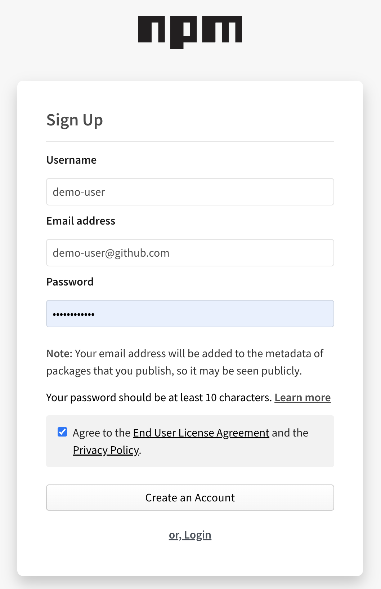

<h1 align="center">Sample repo to demonstrate npm package publish</h1>

<p align="center">
  <a href="#mega-prerequisites">Prerequisites</a> •  
  <a href="#books-resources">Resources</a>
</p>

This repository can be used as a reference guide/sample to enable publishing your first package via npm registry.

## :mega: Prerequisites

- A [npmjs account](https://docs.npmjs.com/creating-a-new-npm-user-account) with a verified e-mail address
- Basic understanding of software package registries (e.g. GitHub Packages, npm)

## Steps for Getting started
### 1. Setup a Project: Setting up a project is required before doing anything.

* Install Node.js
```
1. Go to the [Node.js Downloads page](https://nodejs.org/en/download/)
2. Download Node.js for macOS by clicking the "Macintosh Installer" option
3. Run the downloaded Node.js .pkg Installer
4. Run the installer, including accepting the license, selecting the destination, and authenticating for the install.
5. You're finished! To ensure Node.js has been installed, run node -v in your terminal - you should get something like v6.9.4
```

* Create an npm account.
```
https://www.npmjs.com/signup
```

<p align="center">
  
</p>

* Logging in to the npm account using `npm login`

```
➜  sample-npm-publish git:(main) ✗ npm login
npm notice Log in on https://registry.npmjs.org/
Username: nishgupta
Password:
Email: (this IS public) nishantgupta.cs@gmail.com
npm notice Please use the one-time password (OTP) from your authenticator application
Enter one-time password: 465775
Logged in as nishgupta on https://registry.npmjs.org/.
```

### 2. Initializing a package is required before publishing using `npm init`

```
➜  sample-npm-publish git:(main) ✗ npm init
This utility will walk you through creating a package.json file.
It only covers the most common items, and tries to guess sensible defaults.

See `npm help init` for definitive documentation on these fields
and exactly what they do.

Use `npm install <pkg>` afterwards to install a package and
save it as a dependency in the package.json file.

Press ^C at any time to quit.
package name: (sample-npm-publish) sample-npm-publish
version: (1.0.0) 0.0.0
description: sample package to demonstrate npm publish
entry point: (index.js)
test command:
git repository: (https://github.com/nishantms/sample-npm-publish)
keywords: publish
author: nishant gupta
license: (ISC)
About to write to /Users/nishantms/sample-npm-publish/package.json:

{
  "name": "sample-npm-publish",
  "version": "0.0.0",
  "description": "sample package to demonstrate npm publish",
  "main": "index.js",
  "scripts": {
    "test": "echo \"Error: no test specified\" && exit 1"
  },
  "repository": {
    "type": "git",
    "url": "git+https://github.com/nishantms/sample-npm-publish.git"
  },
  "keywords": [
    "publish"
  ],
  "author": "nishant gupta",
  "license": "ISC",
  "bugs": {
    "url": "https://github.com/nishantms/sample-npm-publish/issues"
  },
  "homepage": "https://github.com/nishantms/sample-npm-publish#readme"
}


Is this OK? (yes) yes
```

### ### 3.  Building a package is required before publishing

Lets first implement a simple function that add two numbers in the npm module. This function looks like below:

File Name: index.js

```
const addFns = {
  add : function addTwoNums( num1, num2 ) {
    return (num1 + num2) ;
  }
}
  
module.exports = addFns
```

### 4. Publishing a package is required before publishing using `npm publish`

To check if your package name is usable or not, go to the command-line and type `npm search addition-two-numbers-module`

```
➜  sample-npm-publish git:(main) ✗ npm search addition-two-numbers-module
No matches found for "addition-two-numbers-module"
```

Now after checking the name availability, go to command-line/terminal and type `npm publish`

```
➜  sample-npm-publish git:(main) ✗ npm publish
npm notice
npm notice 📦  addition-module@0.0.0
npm notice === Tarball Contents ===
npm notice 4.2kB   README.md
npm notice 167.9kB images/signup.png
npm notice 132B    index.js
npm notice 568B    package.json
npm notice === Tarball Details ===
npm notice name:          addition-module
npm notice version:       0.0.0
npm notice filename:      addition-module-0.0.0.tgz
npm notice package size:  115.6 kB
npm notice unpacked size: 172.8 kB
npm notice shasum:        edbfce0c054de6e4c056a243f9ea02c7cd7d1a85
npm notice integrity:     sha512-GhFATM08xEqbC[...]YoVPDPtMpPR0w==
npm notice total files:   4
npm notice
npm notice Publishing to https://registry.npmjs.org/
npm notice Open https://www.npmjs.com/login/7ab7f458-7ebb-47bd-acb9-e50f868b8ea9 to use your security key for authentication or enter OTP from your authenticator app
This operation requires a one-time password.
Enter OTP: 0939932908353002
```


## :books: Resources

- [npm Docs: Getting started](https://docs.npmjs.com/getting-started)
- [GitHub Docs: Workflow syntax](https://docs.github.com/actions/reference/workflow-syntax-for-github-actions)
- [GitHub Docs: GitHub Packages: npm](https://docs.github.com/en/packages/working-with-a-github-packages-registry/working-with-the-npm-registry)